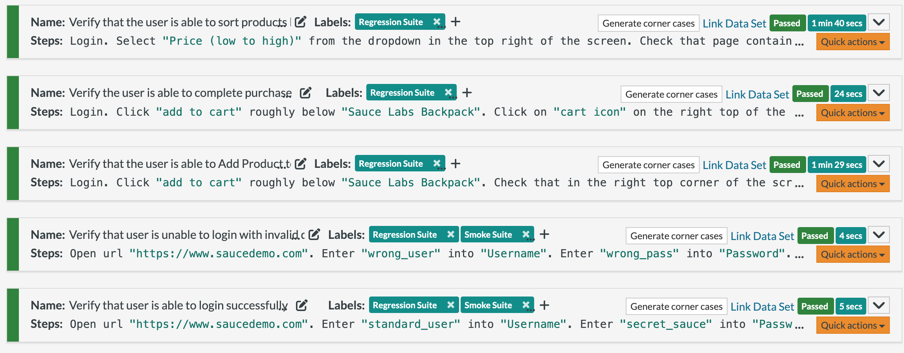
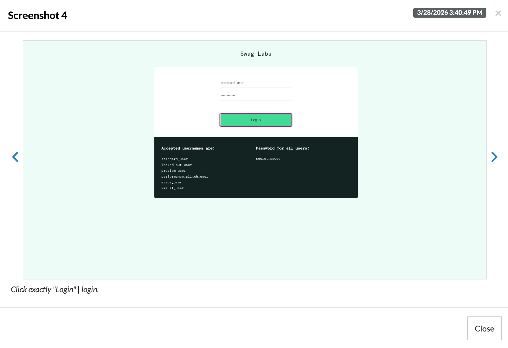
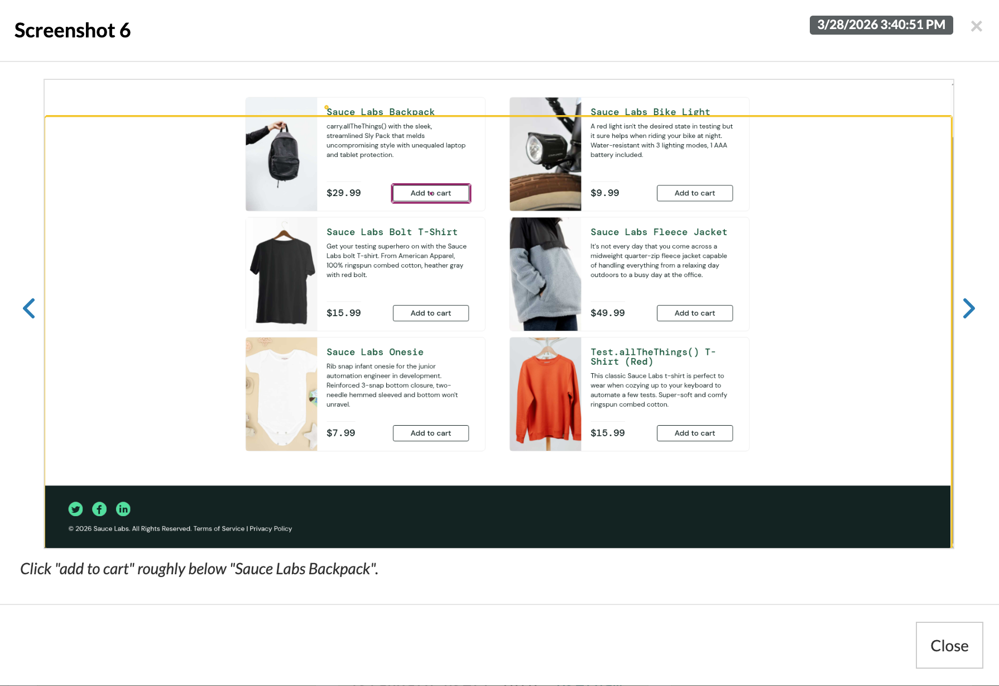
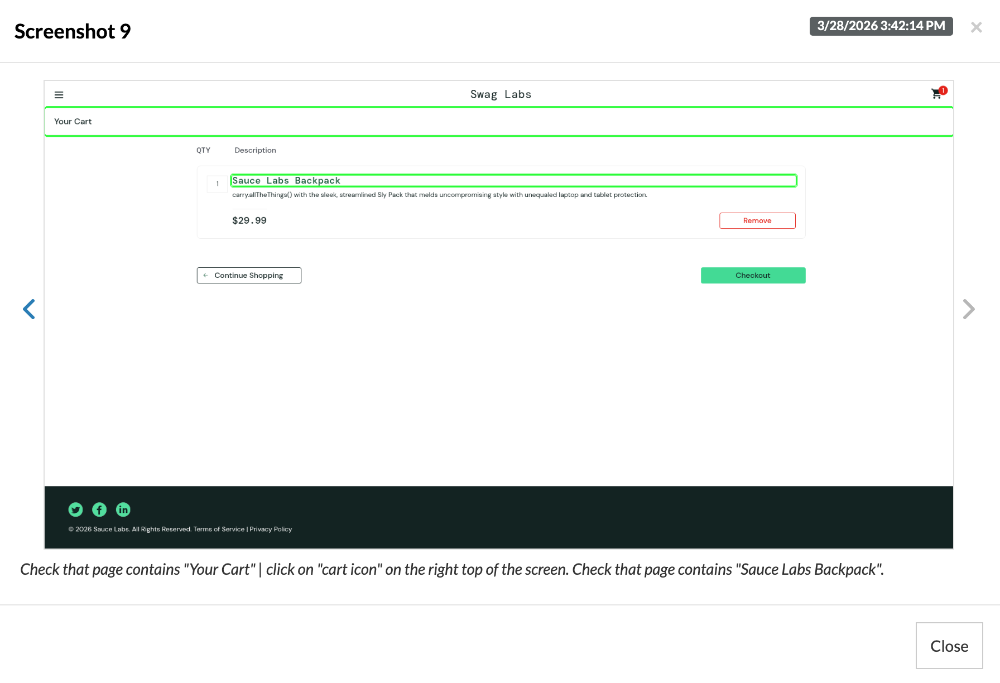
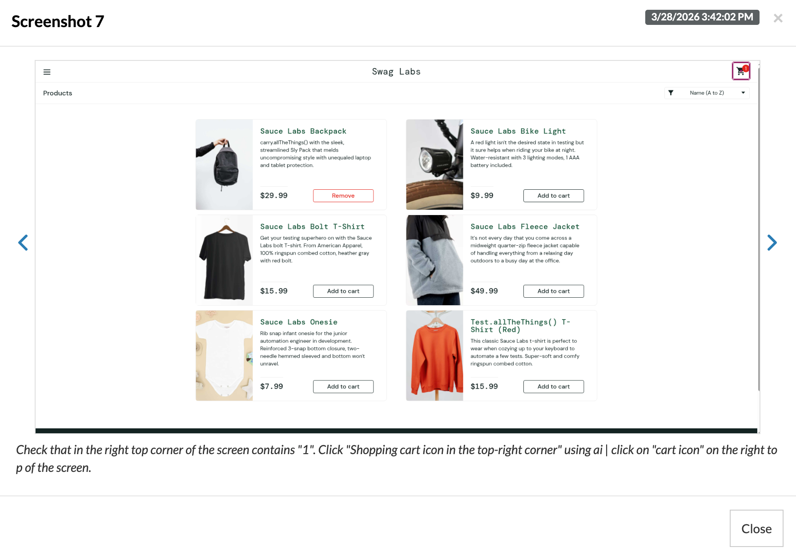
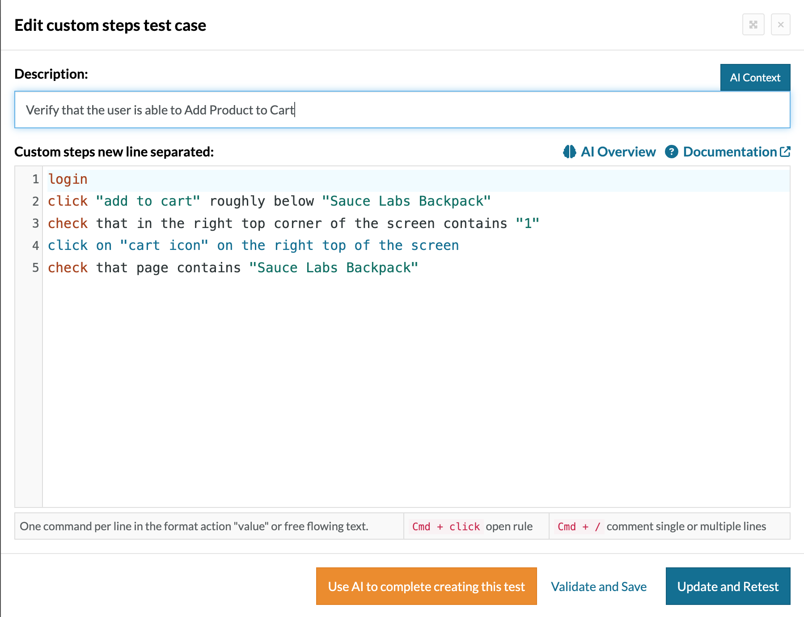

# testRigor E-Commerce Automation Suite

AI-powered end-to-end test automation for a web-based e-commerce platform using testRigor's plain English test NLP based scripting.

---

## Project Overview

This project demonstrates AI-driven test automation using testRigor on the SauceDemo e-commerce platform. It covers core user flows including authentication, product browsing, cart management, and checkout written entirely in Natural language.

**Goal:** Showcase real-world application of AI-powered testing as an alternative to traditional Selenium scripting.

---

## Test Coverage

| # | Test Case | Status |
|---|---|---|
| 1 | Verify that user is able to login successfully | ✅ Pass |
| 2 | Verify that user is unable to login with invalid data | ✅ Pass |
| 3 | Verify that the user is able to Add Product to Cart | ✅ Pass |
| 4 | Verify the user is able to complete purchase | ✅ Pass |
| 5 | Verify that the user is able to sort products by price | ✅ Pass |

---

## Tech Stack

- **Tool:** testRigor (AI-powered test automation)
- **Test syntax:** Natural language Scripting (no code)
- **Application under test:** SauceDemo (saucedemo.com)
- **Type:** End-to-end UI automation
- **Platform:** Web

---

## Key Concepts Demonstrated

- AI-driven element recognition (no XPath or CSS selectors needed)
- End-to-end user journey automation
- Positive and negative test scenario coverage
- Form input validation
- Cart and checkout flow testing
- Dynamic UI interaction (dropdowns, buttons, navigation)

---

## Screenshots

### Test Suite Dashboard

### Login Flow

### Products Page

### Cart Page

### Cart Icon

### Test Script

---

## Why testRigor

Traditional automation tools like Selenium require maintaining locators (XPath, CSS selectors) which break frequently on UI changes. testRigor uses AI to identify elements by how a human would describe them — making tests more stable, readable, and faster to write.

| | Selenium | testRigor |
|---|---|---|
| Syntax | Java/Python code | Natural Language |
| Element strategy | XPath / CSS | AI recognition |
| Maintenance effort | High | Low |
| Speed to write | Slow | Fast |

---

## Certification

This project is backed by hands-on certification:

**AI Test Automation Engineer** — [Certificate](https://drive.google.com/file/d/1etL_9O2MwEITD78c0ofUpQ-G3-a0q2rt/view?usp=sharing)

---

## Author

**Harsh Soni** — QA Automation Engineer
[LinkedIn](https://linkedin.com/in/harshsoni27) · [GitHub](https://github.com/harshsoni27) · [testRigor](https://app.testrigor.com/public/R9dyEuH2CCHauyX9E)
